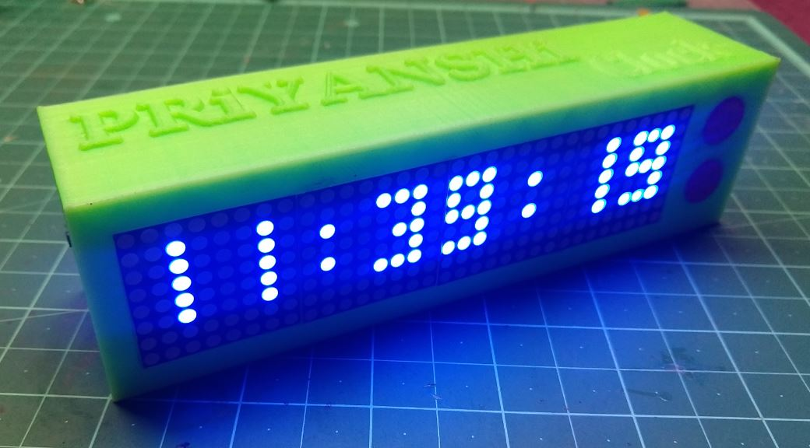
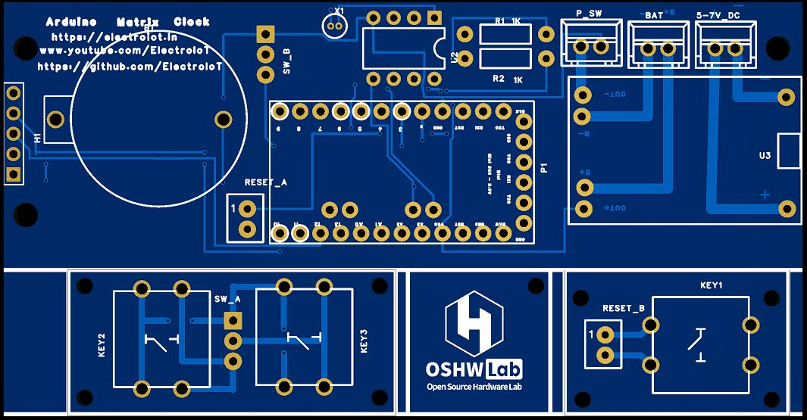
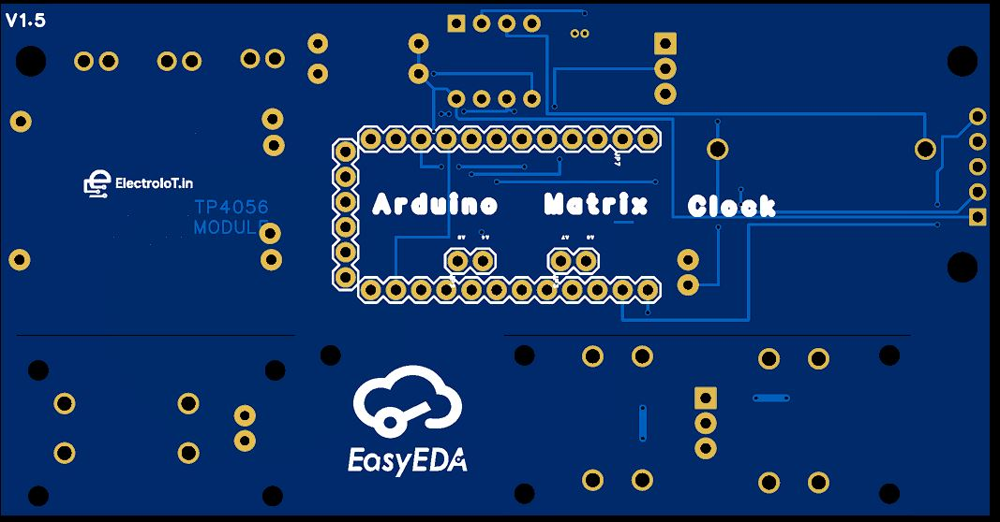

# Arduino Matrix Clock V1.5

A compact and attractive real-time clock (RTC) based on the Arduino Mini and a 4x MAX7219 LED Matrix display. Designed with a custom PCB and powered via TP4056 Li-ion charging module, this project makes a beautiful desk clock with a 3D printed case.

## 🔧 Features

- 🕒 Real-time clock using DS1307+ RTC
- 💡 Bright and crisp 32x8 LED Matrix display (MAX7219)
- 🔋 Battery-powered with TP4056 charging circuit
- 🔘 Multiple buttons for settings
- 🧠 Based on Arduino Mini (3.3V or 5V)
- 📦 Custom 3D printed case

## 🖼️ Demo

## 📦 Hardware Components

| Component          | Quantity | Notes                        |
|--------------------|----------|------------------------------|
| Arduino Pro Mini    | 1        | 3.3V or 5V                   |
| MAX7219 LED Matrix  | 4        | Dot matrix, 8x8              |
| DS1307 RTC Module   | 1        | With 32.768KHz crystal       |
| TP4056 Module       | 1        | For charging 3.7V Li-ion     |
| Push Buttons        | 3        | Time set / mode / reset      |
| 3D Printed Case     | 1        | STL shared below             |
| Custom PCB          | 1        | Designed in EasyEDA          |

## 🖥️ PCB Design

- Designed using **EasyEDA**
- Version: V1.5
- Includes:
  - Slots for Arduino Mini, DS1307, TP4056
  - Ports for 4x Matrix displays
  - Button pads (KEY1, KEY2, KEY3)
  - Power input (BAT / DC 5V)
  - Download PCB: 

### PCB Front:

### PCB Back:

## 🧾 Circuit Diagram

Refer to the PDF for the full schematic:
- [Arduino Matrix MAX7219 Clock.pdf](Arduino%20Matrix%20MAX7219%20Clock.pdf)

## 💻 Arduino Code

You can find the complete source code here:

👉 [`Led_Matrix_Clock.ino`](Led_Matrix_Clock.ino)

### Features in Code:
- Displays current time in HH:MM:SS
- Allows setting time using buttons
- RTC synchronization
- LED scrolling effect (optional)

## 🖨️ 3D Case

- Designed for a 4x MAX7219 display
- Button holes and charging port access included
- You can customize the name on top

## 🔌 Powering the Clock

- Connect a 3.7V Li-ion battery to TP4056
- Or power directly via 5V DC port
- TP4056 manages battery charging safely

## 📷 Build Preview

## 📺 Video Tutorial (Coming Soon)

Stay tuned on our channel:
- [YouTube - ElectroIoT](https://www.youtube.com/ElectroIoT)

## 🌐 More Projects

- Website: [https://electroiot.in](https://electroiot.in)
- GitHub: [ElectroIoT](https://github.com/ElectroIoT)

---

## 📬 License

Open Source Hardware — OSHWA Certified

---

Happy Making! 💡
